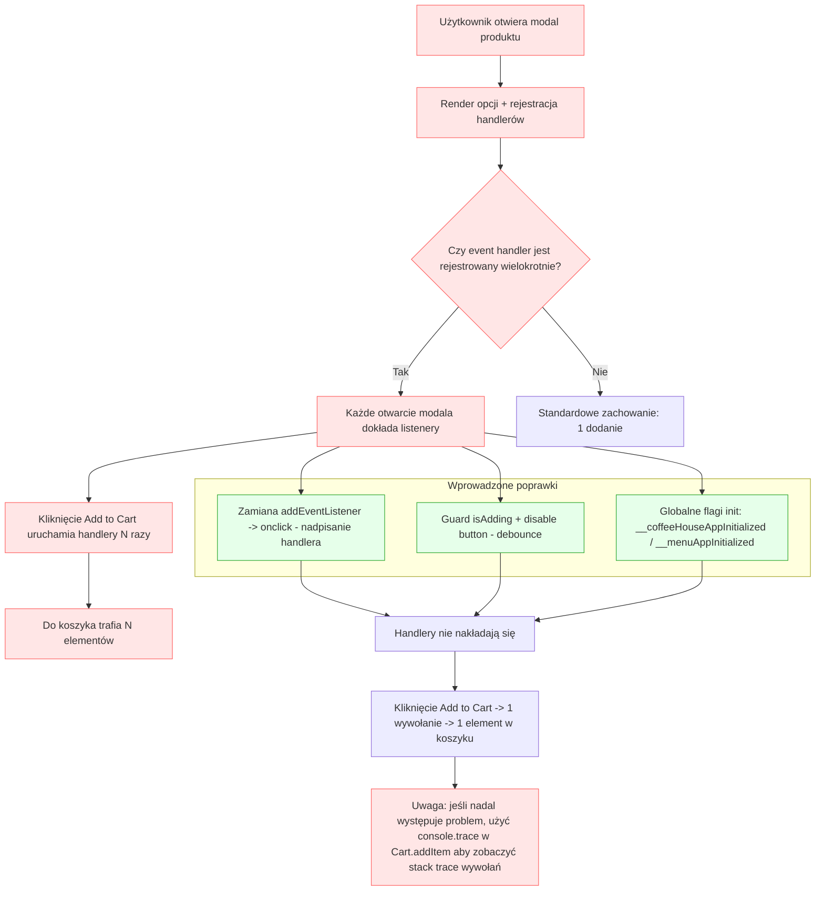

# Problem: Podwójne/ wielokrotne dodawanie do koszyka — analiza i poprawki

Plik zawiera krótkie objaśnienie i diagram pokazujący źródło błędu oraz zastosowane poprawki: nadpisanie onclick zamiast doklejania listenerów, defensywny guard + wyłączenie przycisku, i globalne flagi inicjalizacji aplikacji.