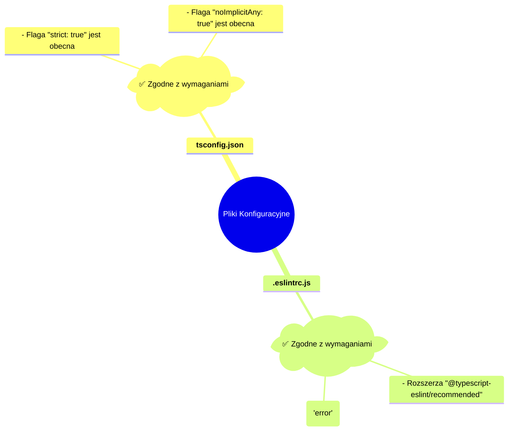

# Analiza Plików Konfiguracyjnych

```mermaid
mindmap
  root((Pliki Konfiguracyjne))
    ::icon(fa fa-cogs)
    **tsconfig.json**
      )✅ Zgodne z wymaganiami(
        - Flaga "strict: true" jest obecna
        - Flaga "noImplicitAny: true" jest obecna
    **.eslintrc.js**
      )✅ Zgodne z wymaganiami(
        - Rozszerza "@typescript-eslint/recommended"
        - Reguła "@typescript-eslint/no-explicit-any" jest włączona ('error')
```
