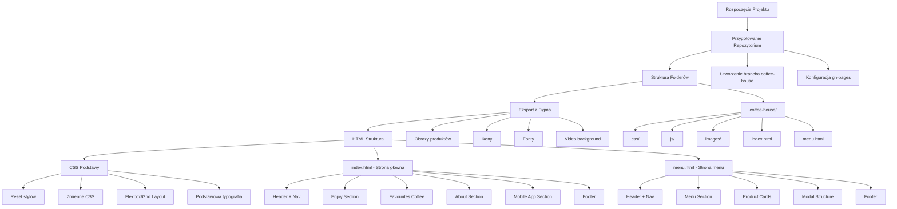

# Etap 1: Struktura i Layout

```mermaid
graph TD
    A[Rozpoczęcie Projektu] --> B[Przygotowanie Repozytorium]
    B --> C[Struktura Folderów]
    C --> D[Eksport z Figma]
    D --> E[HTML Struktura]
    E --> F[CSS Podstawy]
    
    B --> B1[Utworzenie brancha coffee-house]
    B --> B2[Konfiguracja gh-pages]
    
    C --> C1[coffee-house/]
    C1 --> C2[css/]
    C1 --> C3[js/]
    C1 --> C4[images/]
    C1 --> C5[index.html]
    C1 --> C6[menu.html]
    
    D --> D1[Obrazy produktów]
    D --> D2[Ikony]
    D --> D3[Fonty]
    D --> D4[Video background]
    
    E --> E1[index.html - Strona główna]
    E --> E2[menu.html - Strona menu]
    
    E1 --> E1A[Header + Nav]
    E1 --> E1B[Enjoy Section]
    E1 --> E1C[Favourites Coffee]
    E1 --> E1D[About Section]
    E1 --> E1E[Mobile App Section]
    E1 --> E1F[Footer]
    
    E2 --> E2A[Header + Nav]
    E2 --> E2B[Menu Section]
    E2 --> E2C[Product Cards]
    E2 --> E2D[Modal Structure]
    E2 --> E2E[Footer]
    
    F --> F1[Reset stylów]
    F --> F2[Zmienne CSS]
    F --> F3[Flexbox/Grid Layout]
    F --> F4[Podstawowa typografia]
```