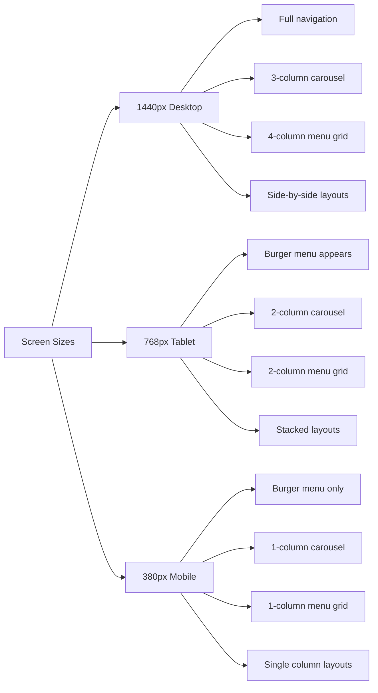

# ETAP 1 - Struktura projektu i podstawowe pliki

## Diagram struktury projektu

```mermaid
graph TD
    A[Coffee House Project] --> B[Git Repository]
    A --> C[File Structure]
    A --> D[HTML Pages]
    A --> E[CSS Styles]
    
    B --> B1[master branch - README.md, .gitignore]
    B --> B2[coffee-house branch - development]
    
    C --> C1[styles/ - CSS files]
    C --> C2[scripts/ - JavaScript files]
    C --> C3[assets/ - Images, icons, videos]
    C --> C4[diagrams/ - Documentation]
    
    D --> D1[index.html - Home page]
    D --> D2[menu.html - Menu page]
    
    D1 --> D1A[Header with navigation]
    D1 --> D1B[Enjoy section - hero]
    D1 --> D1C[Favorites section - carousel]
    D1 --> D1D[About section]
    D1 --> D1E[Mobile App section]
    D1 --> D1F[Footer with contacts]
    
    D2 --> D2A[Header with disabled menu]
    D2 --> D2B[Menu section with tabs]
    D2 --> D2C[Product grid]
    D2 --> D2D[Modal for product details]
    D2 --> D2E[Footer]
    
    E --> E1[style.css - Main stylesheet]
    E1 --> E1A[Reset and base styles]
    E1 --> E1B[Header and navigation]
    E1 --> E1C[Section layouts]
    E1 --> E1D[Responsive breakpoints]
    E1 --> E1E[Modal styles]
```



## Responsive Design Strategy



## CSS Architecture

```mermaid
graph TD
    A[CSS Structure] --> B[Reset & Base]
    A --> C[Layout Components]
    A --> D[Interactive Elements]
    A --> E[Responsive Rules]
    
    B --> B1[* reset]
    B --> B2[html scroll-behavior]
    B --> B3[body font & colors]
    
    C --> C1[.container - max-width centering]
    C --> C2[.header - sticky navigation]
    C --> C3[.section layouts]
    C --> C4[.footer - contact info]
    
    D --> D1[.carousel - image slider]
    D --> D2[.modal - product details]
    D --> D3[.burger - mobile menu]
    D --> D4[.tabs - category switching]
    
    E --> E1[@media 768px - tablet]
    E --> E2[@media 380px - mobile]
    E --> E3[Grid column adjustments]
    E --> E4[Navigation hiding/showing]
```

## Następne etapy

### ETAP 2 - JavaScript Functionality
- Carousel automation and controls
- Burger menu implementation
- Smooth scrolling navigation
- Basic interactivity

### ETAP 3 - Advanced Features
- Menu product loading from JSON
- Modal functionality with size/additives
- Load more button for mobile
- Final responsive adjustments