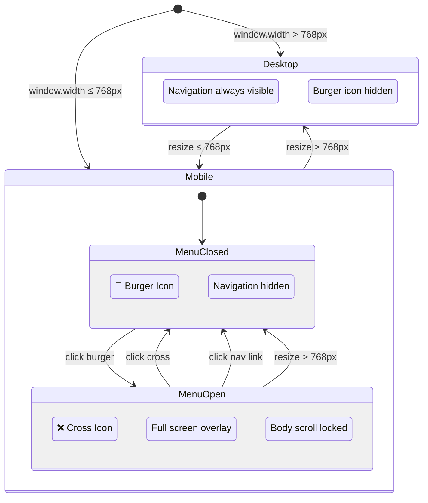

# Burger Menu - Funkcjonalność

```mermaid
stateDiagram-v2
    [*] --> Desktop: window.width > 768px
    [*] --> Mobile: window.width ≤ 768px
    
    Desktop --> Mobile: resize ≤ 768px
    Mobile --> Desktop: resize > 768px
    
    state Mobile {
        [*] --> MenuClosed
        MenuClosed --> MenuOpen: click burger
        MenuOpen --> MenuClosed: click cross
        MenuOpen --> MenuClosed: click nav link
        MenuOpen --> MenuClosed: resize > 768px
        
        state MenuClosed {
            BurgerIcon: 🍔 Burger Icon
            NavHidden: Navigation hidden
        }
        
        state MenuOpen {
            CrossIcon: ❌ Cross Icon
            NavVisible: Full screen overlay
            BodyLocked: Body scroll locked
        }
    }
    
    state Desktop {
        AlwaysVisible: Navigation always visible
        BurgerHidden: Burger icon hidden
    }
```