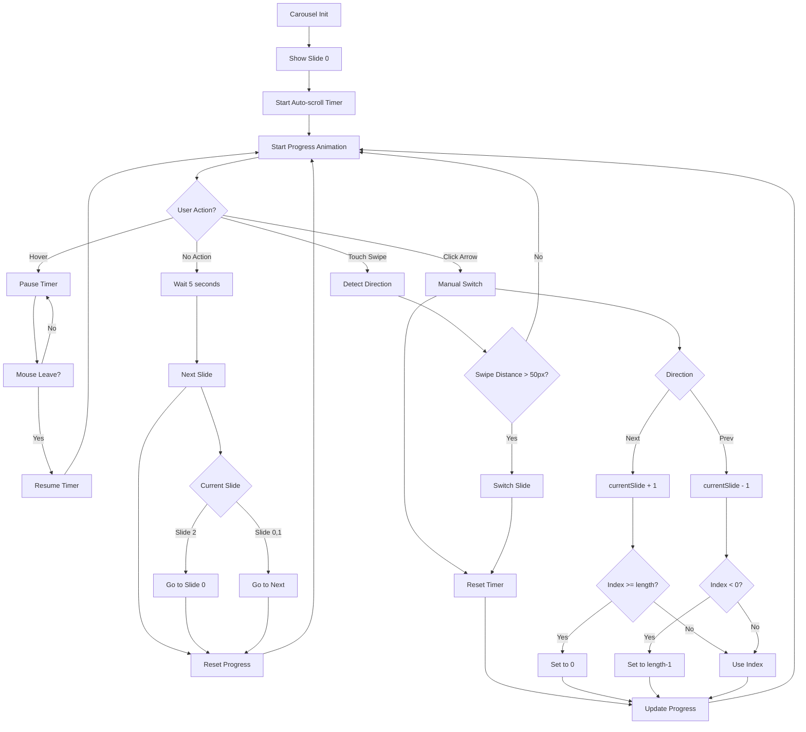

# Karuzela - Funkcjonalność

```mermaid
graph TD
    A[Carousel Init] --> B[Show Slide 0]
    B --> C[Start Auto-scroll Timer]
    C --> D[Start Progress Animation]
    
    D --> E{User Action?}
    
    E -->|No Action| F[Wait 5 seconds]
    F --> G[Next Slide]
    G --> H[Reset Progress]
    H --> D
    
    E -->|Hover| I[Pause Timer]
    I --> J[Mouse Leave?]
    J -->|Yes| K[Resume Timer]
    K --> D
    J -->|No| I
    
    E -->|Click Arrow| L[Manual Switch]
    L --> M[Reset Timer]
    M --> N[Update Progress]
    N --> D
    
    E -->|Touch Swipe| O[Detect Direction]
    O --> P{Swipe Distance > 50px?}
    P -->|Yes| Q[Switch Slide]
    P -->|No| D
    Q --> M
    
    G --> R{Current Slide}
    R -->|Slide 2| S[Go to Slide 0]
    R -->|Slide 0,1| T[Go to Next]
    S --> H
    T --> H
    
    L --> U{Direction}
    U -->|Next| V[currentSlide + 1]
    U -->|Prev| W[currentSlide - 1]
    V --> X{Index >= length?}
    W --> Y{Index < 0?}
    X -->|Yes| Z[Set to 0]
    X -->|No| AA[Use Index]
    Y -->|Yes| BB[Set to length-1]
    Y -->|No| AA
    Z --> N
    BB --> N
    AA --> N
```