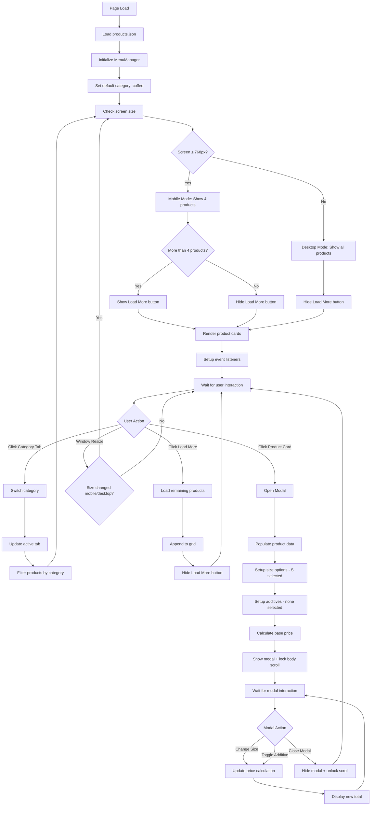

# Menu Management - Funkcjonalność

```mermaid
flowchart TD
    A[Page Load] --> B[Load products.json]
    B --> C[Initialize MenuManager]
    C --> D[Set default category: coffee]
    D --> E[Check screen size]
    
    E --> F{Screen ≤ 768px?}
    F -->|Yes| G[Mobile Mode: Show 4 products]
    F -->|No| H[Desktop Mode: Show all products]
    
    G --> I{More than 4 products?}
    I -->|Yes| J[Show Load More button]
    I -->|No| K[Hide Load More button]
    
    H --> L[Hide Load More button]
    J --> M[Render product cards]
    K --> M
    L --> M
    
    M --> N[Setup event listeners]
    N --> O[Wait for user interaction]
    
    O --> P{User Action}
    
    P -->|Click Category Tab| Q[Switch category]
    Q --> R[Update active tab]
    R --> S[Filter products by category]
    S --> E
    
    P -->|Click Load More| T[Load remaining products]
    T --> U[Append to grid]
    U --> V[Hide Load More button]
    V --> O
    
    P -->|Window Resize| W{Size changed mobile/desktop?}
    W -->|Yes| E
    W -->|No| O
    
    P -->|Click Product Card| X[Open Modal]
    X --> Y[Populate product data]
    Y --> Z[Setup size options - S selected]
    Z --> AA[Setup additives - none selected]
    AA --> BB[Calculate base price]
    BB --> CC[Show modal + lock body scroll]
    CC --> DD[Wait for modal interaction]
    
    DD --> EE{Modal Action}
    EE -->|Change Size| FF[Update price calculation]
    EE -->|Toggle Additive| FF
    FF --> GG[Display new total]
    GG --> DD
    
    EE -->|Close Modal| HH[Hide modal + unlock scroll]
    HH --> O
```