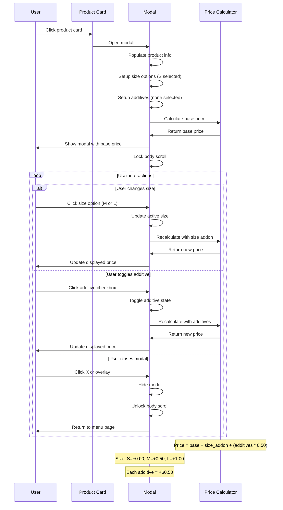

# Modal System - Funkcjonalność

```mermaid
sequenceDiagram
    participant U as User
    participant C as Product Card
    participant M as Modal
    participant P as Price Calculator
    
    U->>C: Click product card
    C->>M: Open modal
    M->>M: Populate product info
    M->>M: Setup size options (S selected)
    M->>M: Setup additives (none selected)
    M->>P: Calculate base price
    P->>M: Return base price
    M->>U: Show modal with base price
    M->>M: Lock body scroll
    
    loop User interactions
        alt User changes size
            U->>M: Click size option (M or L)
            M->>M: Update active size
            M->>P: Recalculate with size addon
            P->>M: Return new price
            M->>U: Update displayed price
        else User toggles additive
            U->>M: Click additive checkbox
            M->>M: Toggle additive state
            M->>P: Recalculate with additives
            P->>M: Return new price
            M->>U: Update displayed price
        else User closes modal
            U->>M: Click X or overlay
            M->>M: Hide modal
            M->>M: Unlock body scroll
            M->>U: Return to menu page
        end
    end
    
    Note over P: Price = base + size_addon + (additives * 0.50)
    Note over M: Size: S=+0.00, M=+0.50, L=+1.00
    Note over M: Each additive = +$0.50
```