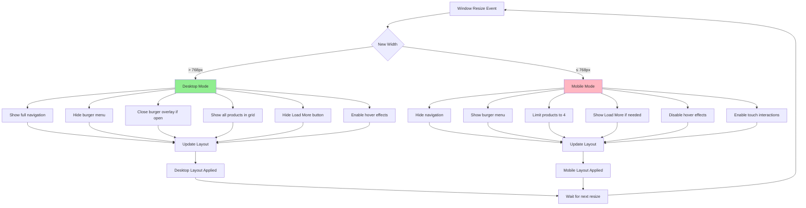

# Responsive Behavior - Funkcjonalność

```mermaid
graph TD
    A[Window Resize Event] --> B{New Width}
    
    B -->|> 768px| C[Desktop Mode]
    B -->|≤ 768px| D[Mobile Mode]
    
    C --> C1[Show full navigation]
    C --> C2[Hide burger menu]
    C --> C3[Close burger overlay if open]
    C --> C4[Show all products in grid]
    C --> C5[Hide Load More button]
    C --> C6[Enable hover effects]
    
    D --> D1[Hide navigation]
    D --> D2[Show burger menu]
    D --> D3[Limit products to 4]
    D --> D4[Show Load More if needed]
    D --> D5[Disable hover effects]
    D --> D6[Enable touch interactions]
    
    C1 --> E[Update Layout]
    C2 --> E
    C3 --> E
    C4 --> E
    C5 --> E
    C6 --> E
    
    D1 --> F[Update Layout]
    D2 --> F
    D3 --> F
    D4 --> F
    D5 --> F
    D6 --> F
    
    E --> G[Desktop Layout Applied]
    F --> H[Mobile Layout Applied]
    
    G --> I[Wait for next resize]
    H --> I
    I --> A
    
    style C fill:#90EE90
    style D fill:#FFB6C1
```