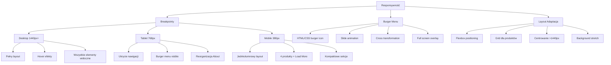

# Etap 2: Responsywność

```mermaid
graph TD
    A[Responsywność] --> B[Breakpointy]
    A --> C[Burger Menu]
    A --> D[Layout Adaptacja]
    
    B --> B1[Desktop 1440px+]
    B --> B2[Tablet 768px]
    B --> B3[Mobile 380px]
    
    B1 --> B1A[Pełny layout]
    B1 --> B1B[Hover efekty]
    B1 --> B1C[Wszystkie elementy widoczne]
    
    B2 --> B2A[Ukrycie nawigacji]
    B2 --> B2B[Burger menu visible]
    B2 --> B2C[Reorganizacja About]
    
    B3 --> B3A[Jednkolumnowy layout]
    B3 --> B3B[4 produkty + Load More]
    B3 --> B3C[Kompaktowe sekcje]
    
    C --> C1[HTML/CSS burger icon]
    C --> C2[Slide animation]
    C --> C3[Cross transformation]
    C --> C4[Full screen overlay]
    
    D --> D1[Flexbox positioning]
    D --> D2[Grid dla produktów]
    D --> D3[Centrowanie >1440px]
    D --> D4[Background stretch]
```