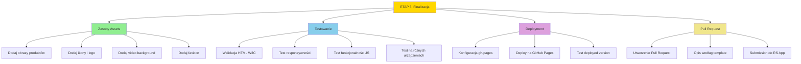

# ETAP 3: Finalizacja Projektu

```mermaid
graph TD
    A[ETAP 3: Finalizacja] --> B[Zasoby Assets]
    A --> C[Testowanie]
    A --> D[Deployment]
    A --> E[Pull Request]
    
    B --> B1[Dodaj obrazy produktów]
    B --> B2[Dodaj ikony i logo]
    B --> B3[Dodaj video background]
    B --> B4[Dodaj favicon]
    
    C --> C1[Walidacja HTML W3C]
    C --> C2[Test responsywności]
    C --> C3[Test funkcjonalności JS]
    C --> C4[Test na różnych urządzeniach]
    
    D --> D1[Konfiguracja gh-pages]
    D --> D2[Deploy na GitHub Pages]
    D --> D3[Test deployed version]
    
    E --> E1[Utworzenie Pull Request]
    E --> E2[Opis według template]
    E --> E3[Submission do RS App]
    
    style A fill:#FFD700
    style B fill:#90EE90
    style C fill:#87CEEB
    style D fill:#DDA0DD
    style E fill:#F0E68C
```