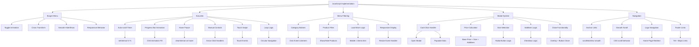

# Etap 3: JavaScript Funkcjonalność

```mermaid
graph TD
    A[JavaScript Implementation] --> B[Burger Menu]
    A --> C[Karuzela]
    A --> D[Menu Filtering]
    A --> E[Modal System]
    A --> F[Navigation]
    
    B --> B1[Toggle Animation]
    B --> B2[Cross Transform]
    B --> B3[Smooth Hide/Show]
    B --> B4[Responsive Behavior]
    
    C --> C1[Auto-scroll Timer]
    C --> C2[Progress Bar Animation]
    C --> C3[Hover Pause]
    C --> C4[Manual Controls]
    C --> C5[Touch Swipe]
    C --> C6[Loop Logic]
    
    C1 --> C1A[setInterval 5-7s]
    C2 --> C2A[CSS Animation Fill]
    C3 --> C3A[clearInterval on hover]
    C4 --> C4A[Arrow Click Handlers]
    C5 --> C5A[Touch Events]
    C6 --> C6A[Circular Navigation]
    
    D --> D1[Category Buttons]
    D --> D2[Product Filter]
    D --> D3[Load More Logic]
    D --> D4[Responsive Display]
    
    D1 --> D1A[Click Event Listeners]
    D2 --> D2A[Show/Hide Products]
    D3 --> D3A[Mobile: 4 items limit]
    D4 --> D4A[Resize Event Handler]
    
    E --> E1[Card Click Handler]
    E --> E2[Price Calculator]
    E --> E3[Size Selection]
    E --> E4[Additives Logic]
    E --> E5[Close Functionality]
    
    E1 --> E1A[Open Modal]
    E1 --> E1B[Populate Data]
    E2 --> E2A[Base Price + Size + Additives]
    E3 --> E3A[Radio Button Logic]
    E4 --> E4A[Checkbox Logic]
    E5 --> E5A[Overlay + Button Close]
    
    F --> F1[Anchor Links]
    F --> F2[Smooth Scroll]
    F --> F3[Logo Navigation]
    F --> F4[Footer Links]
    
    F1 --> F1A[scrollIntoView smooth]
    F2 --> F2A[CSS scroll-behavior]
    F3 --> F3A[Home Page Redirect]
    F4 --> F4A[Tel + Maps Links]
```