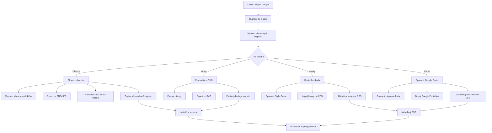

# Figma Export Guide - Coffee House

## Jak eksportować zasoby z Figmy



## Krok po krok:

### 1. **Przygotowanie Figmy:**
```
1. Otwórz link: https://www.figma.com/file/SAoBmuOqTfguehdT4IFRxQ/Coffee-House
2. Kliknij strzałkę obok nazwy → "Duplicate to your drafts"
3. Otwórz swoją kopię z "In Drafts"
```

### 2. **Export obrazów produktów:**
```
1. Zaznacz obrazy kawy w sekcji Favourites
2. Prawy panel → Export
3. Format: JPG, 2x resolution
4. Nazwij: coffee-1.jpg, coffee-2.jpg, etc.
5. Zapisz w assets/
```

### 3. **Export ikon SVG:**
```
1. Zaznacz logo Coffee House
2. Export → SVG
3. Zapisz jako logo.svg
4. Powtórz dla ikon social media, kategorii menu
```

### 4. **Kolory z Style Guide:**
```
1. Sprawdź panel Style Guide w Figmie
2. Skopiuj hex kody kolorów
3. Aktualizuj CSS variables:
   --primary-brown: #403F3D
   --secondary-beige: #E1D4C9
   --accent-brown: #B0907A
```

### 5. **Fonty:**
```
1. Sprawdź używane fonty (prawdopodobnie Inter)
2. Dodaj do HTML:
   <link href="https://fonts.googleapis.com/css2?family=Inter:wght@400;600&display=swap" rel="stylesheet">
```

## Potrzebne zasoby:

### Obrazy:
- coffee-1.jpg do coffee-8.jpg (karuzela)
- about-1.jpg, about-2.jpg (sekcja About)
- mobile-screens.png (sekcja Mobile App)
- video.mp4 (background Enjoy)

### Ikony SVG:
- logo.svg
- coffee-cup.svg, tea-cup.svg, dessert.svg (kategorie menu)
- twitter.svg, instagram.svg, facebook.svg (social)
- apple.svg, google.svg (app store)
- pin-alt.svg, phone.svg, clock.svg (kontakt)

### Favicon:
- Wyeksportuj logo jako 32x32 PNG
- Konwertuj na favicon.ico online