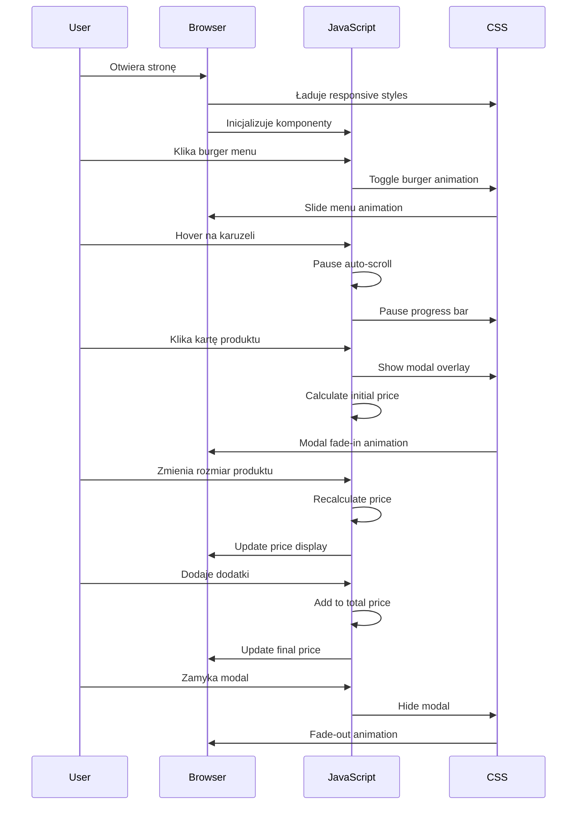

# Flow Interakcji Użytkownika

```mermaid
sequenceDiagram
    participant U as User
    participant B as Browser
    participant JS as JavaScript
    participant CSS as CSS
    
    U->>B: Otwiera stronę
    B->>CSS: Ładuje responsive styles
    B->>JS: Inicjalizuje komponenty
    
    U->>JS: Klika burger menu
    JS->>CSS: Toggle burger animation
    CSS->>B: Slide menu animation
    
    U->>JS: Hover na karuzeli
    JS->>JS: Pause auto-scroll
    JS->>CSS: Pause progress bar
    
    U->>JS: Klika kartę produktu
    JS->>CSS: Show modal overlay
    JS->>JS: Calculate initial price
    CSS->>B: Modal fade-in animation
    
    U->>JS: Zmienia rozmiar produktu
    JS->>JS: Recalculate price
    JS->>B: Update price display
    
    U->>JS: Dodaje dodatki
    JS->>JS: Add to total price
    JS->>B: Update final price
    
    U->>JS: Zamyka modal
    JS->>CSS: Hide modal
    CSS->>B: Fade-out animation
```