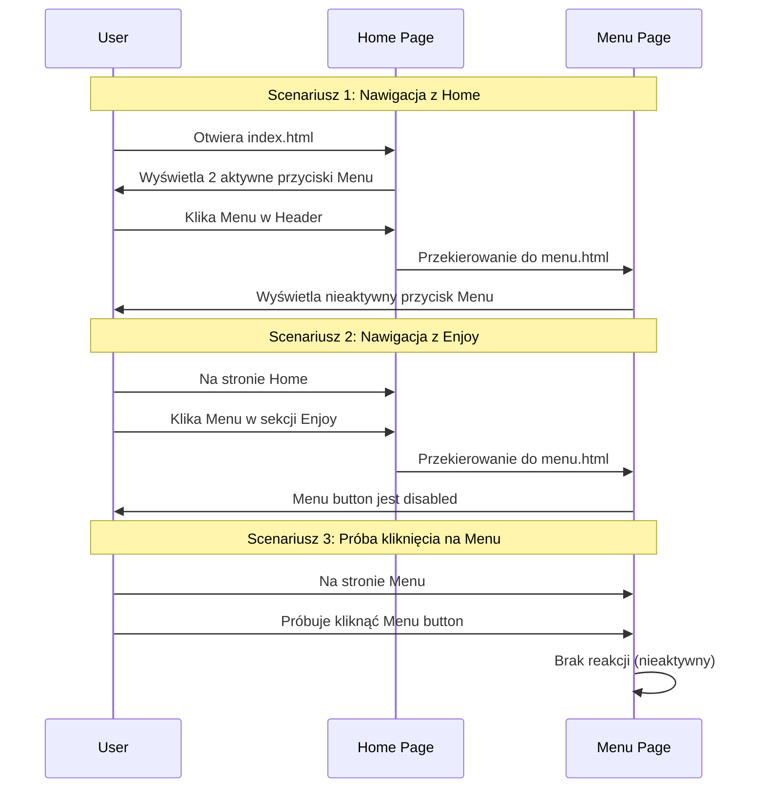

# Flow Nawigacji Menu

```mermaid
sequenceDiagram
    participant U as User
    participant H as Home Page
    participant M as Menu Page
    
    Note over U,M: Scenariusz 1: Nawigacja z Home
    U->>H: Otwiera index.html
    H->>U: Wyświetla 2 aktywne przyciski Menu
    U->>H: Klika Menu w Header
    H->>M: Przekierowanie do menu.html
    M->>U: Wyświetla nieaktywny przycisk Menu
    
    Note over U,M: Scenariusz 2: Nawigacja z Enjoy
    U->>H: Na stronie Home
    U->>H: Klika Menu w sekcji Enjoy
    H->>M: Przekierowanie do menu.html
    M->>U: Menu button jest disabled
    
    Note over U,M: Scenariusz 3: Próba kliknięcia na Menu
    U->>M: Na stronie Menu
    U->>M: Próbuje kliknąć Menu button
    M->>M: Brak reakcji (nieaktywny)
```