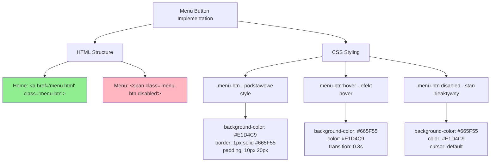

# Implementacja CSS i HTML

```mermaid
graph TD
    A[Menu Button Implementation] --> B[HTML Structure]
    A --> C[CSS Styling]
    
    B --> B1[Home: &lt;a href='menu.html' class='menu-btn'&gt;]
    B --> B2[Menu: &lt;span class='menu-btn disabled'&gt;]
    
    C --> C1[.menu-btn - podstawowe style]
    C --> C2[.menu-btn:hover - efekt hover]
    C --> C3[.menu-btn.disabled - stan nieaktywny]
    
    C1 --> C1A[background-color: #E1D4C9<br/>border: 1px solid #665F55<br/>padding: 10px 20px]
    
    C2 --> C2A[background-color: #665F55<br/>color: #E1D4C9<br/>transition: 0.3s]
    
    C3 --> C3A[background-color: #665F55<br/>color: #E1D4C9<br/>cursor: default]
    
    style B1 fill:#90EE90
    style B2 fill:#FFB6C1
```