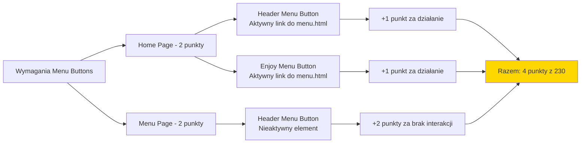

# Punktacja Według Specyfikacji

```mermaid
graph LR
    A[Wymagania Menu Buttons] --> B[Home Page - 2 punkty]
    A --> C[Menu Page - 2 punkty]
    
    B --> B1[Header Menu Button<br/>Aktywny link do menu.html]
    B --> B2[Enjoy Menu Button<br/>Aktywny link do menu.html]
    
    C --> C1[Header Menu Button<br/>Nieaktywny element]
    
    B1 --> D1["+1 punkt za działanie"]
    B2 --> D2["+1 punkt za działanie"]
    C1 --> D3["+2 punkty za brak interakcji"]
    
    D1 --> E[Razem: 4 punkty z 230]
    D2 --> E
    D3 --> E
    
    style E fill:#FFD700
```