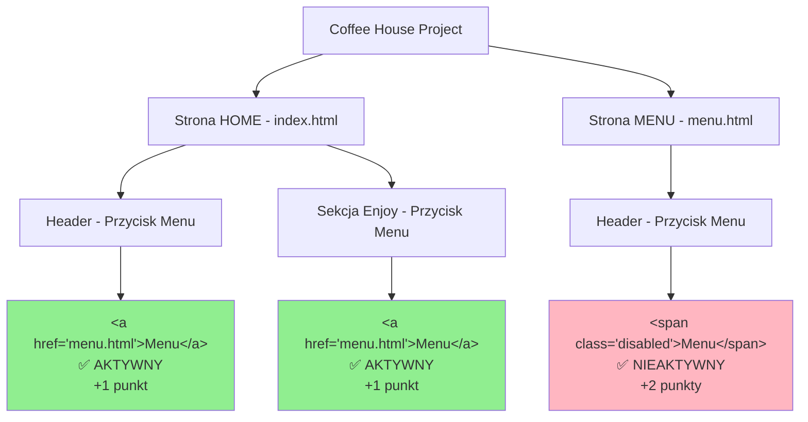

# Diagram Rozmieszczenia Przycisków Menu

```mermaid
graph TD
    A[Coffee House Project] --> B[Strona HOME - index.html]
    A --> C[Strona MENU - menu.html]
    
    B --> B1[Header - Przycisk Menu]
    B --> B2[Sekcja Enjoy - Przycisk Menu]
    
    C --> C1[Header - Przycisk Menu]
    
    B1 --> B1A["&lt;a href='menu.html'&gt;Menu&lt;/a&gt;<br/>✅ AKTYWNY<br/>+1 punkt"]
    B2 --> B2A["&lt;a href='menu.html'&gt;Menu&lt;/a&gt;<br/>✅ AKTYWNY<br/>+1 punkt"]
    
    C1 --> C1A["&lt;span class='disabled'&gt;Menu&lt;/span&gt;<br/>✅ NIEAKTYWNY<br/>+2 punkty"]
    
    style B1A fill:#90EE90
    style B2A fill:#90EE90
    style C1A fill:#FFB6C1
```