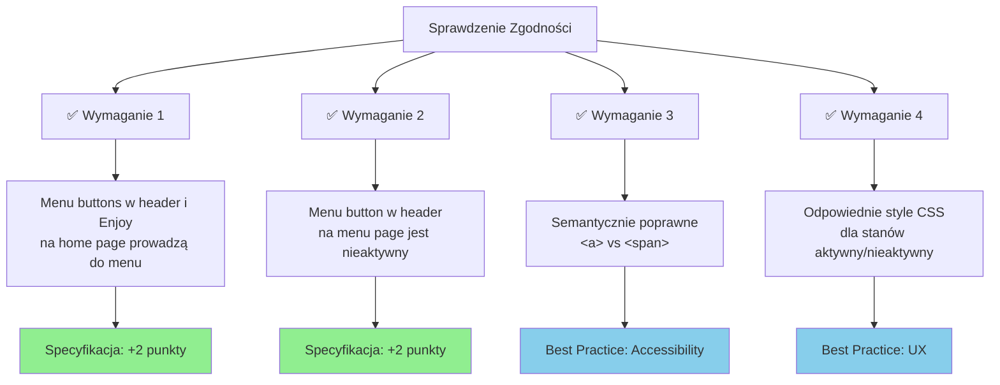

# Walidacja Zgodności ze Specyfikacją

```mermaid
graph TD
    A[Sprawdzenie Zgodności] --> B[✅ Wymaganie 1]
    A --> C[✅ Wymaganie 2]
    A --> D[✅ Wymaganie 3]
    A --> E[✅ Wymaganie 4]
    
    B --> B1["Menu buttons w header i Enjoy<br/>na home page prowadzą do menu"]
    C --> C1["Menu button w header<br/>na menu page jest nieaktywny"]
    D --> D1["Semantycznie poprawne<br/>&lt;a&gt; vs &lt;span&gt;"]
    E --> E1["Odpowiednie style CSS<br/>dla stanów aktywny/nieaktywny"]
    
    B1 --> F[Specyfikacja: +2 punkty]
    C1 --> G[Specyfikacja: +2 punkty]
    D1 --> H[Best Practice: Accessibility]
    E1 --> I[Best Practice: UX]
    
    style F fill:#90EE90
    style G fill:#90EE90
    style H fill:#87CEEB
    style I fill:#87CEEB
```