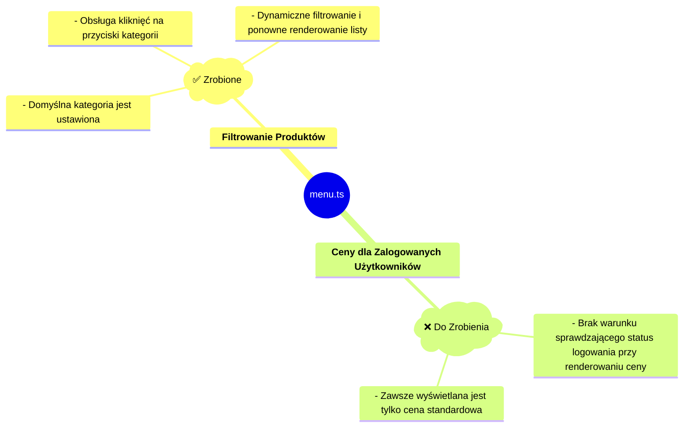

# Analiza Skryptu: menu.ts

```mermaid
mindmap
  root((menu.ts))
    ::icon(fa fa-list-alt)
    **Filtrowanie Produktów**
      )✅ Zrobione(
        - Domyślna kategoria jest ustawiona
        - Obsługa kliknięć na przyciski kategorii
        - Dynamiczne filtrowanie i ponowne renderowanie listy
    **Ceny dla Zalogowanych Użytkowników**
      )❌ Do Zrobienia(
        - Brak warunku sprawdzającego status logowania przy renderowaniu ceny
        - Zawsze wyświetlana jest tylko cena standardowa
```
