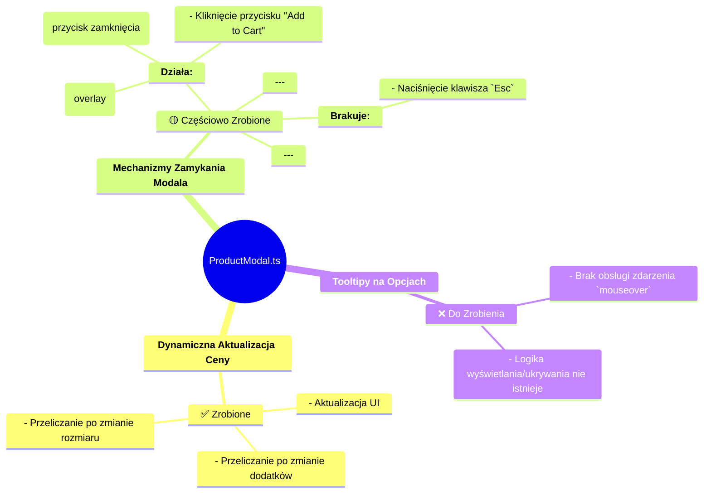

# Analiza Komponentu: ProductModal

```mermaid
mindmap
  root((ProductModal.ts))
    ::icon(fa fa-coffee)
    **Dynamiczna Aktualizacja Ceny**
      ✅ Zrobione
        - Przeliczanie po zmianie rozmiaru
        - Przeliczanie po zmianie dodatków
        - Aktualizacja UI
    **Mechanizmy Zamykania Modala**
      🟡 Częściowo Zrobione
        ---
        **Działa:**
          - Kliknięcie na 'X' (przycisk zamknięcia)
          - Kliknięcie na tło (overlay)
          - Kliknięcie przycisku "Add to Cart"
        ---
        **Brakuje:**
          - Naciśnięcie klawisza `Esc`
    **Tooltipy na Opcjach**
      ❌ Do Zrobienia
        - Brak obsługi zdarzenia `mouseover`
        - Logika wyświetlania/ukrywania nie istnieje
```