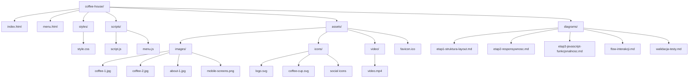

# Struktura Plików

```mermaid
graph TD
    A[coffee-house/] --> B[index.html]
    A --> C[menu.html]
    A --> D[styles/]
    A --> E[scripts/]
    A --> F[assets/]
    A --> G[diagrams/]
    
    D --> D1[style.css]
    
    E --> E1[script.js]
    E --> E2[menu.js]
    
    F --> F1[images/]
    F --> F2[icons/]
    F --> F3[video/]
    F --> F4[favicon.ico]
    
    F1 --> F1A[coffee-1.jpg]
    F1 --> F1B[coffee-2.jpg]
    F1 --> F1C[about-1.jpg]
    F1 --> F1D[mobile-screens.png]
    
    F2 --> F2A[logo.svg]
    F2 --> F2B[coffee-cup.svg]
    F2 --> F2C[social icons]
    
    F3 --> F3A[video.mp4]
    
    G --> G1[etap1-struktura-layout.md]
    G --> G2[etap2-responsywnosc.md]
    G --> G3[etap3-javascript-funkcjonalnosc.md]
    G --> G4[flow-interakcji.md]
    G --> G5[walidacja-testy.md]
```