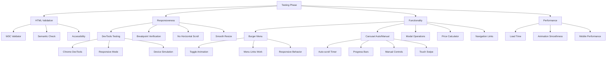

# Walidacja i Testy

```mermaid
graph TD
    A[Testing Phase] --> B[HTML Validation]
    A --> C[Responsiveness]
    A --> D[Functionality]
    A --> E[Performance]
    
    B --> B1[W3C Validator]
    B --> B2[Semantic Check]
    B --> B3[Accessibility]
    
    C --> C1[DevTools Testing]
    C --> C2[Breakpoint Verification]
    C --> C3[No Horizontal Scroll]
    C --> C4[Smooth Resize]
    
    D --> D1[Burger Menu]
    D --> D2[Carousel Auto/Manual]
    D --> D3[Modal Operations]
    D --> D4[Price Calculator]
    D --> D5[Navigation Links]
    
    E --> E1[Load Time]
    E --> E2[Animation Smoothness]
    E --> E3[Mobile Performance]
    
    C1 --> C1A[Chrome DevTools]
    C1 --> C1B[Responsive Mode]
    C1 --> C1C[Device Simulation]
    
    D1 --> D1A[Toggle Animation]
    D1 --> D1B[Menu Links Work]
    D1 --> D1C[Responsive Behavior]
    
    D2 --> D2A[Auto-scroll Timer]
    D2 --> D2B[Progress Bars]
    D2 --> D2C[Manual Controls]
    D2 --> D2D[Touch Swipe]
```